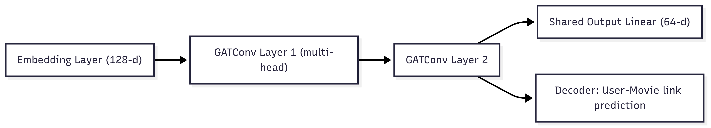
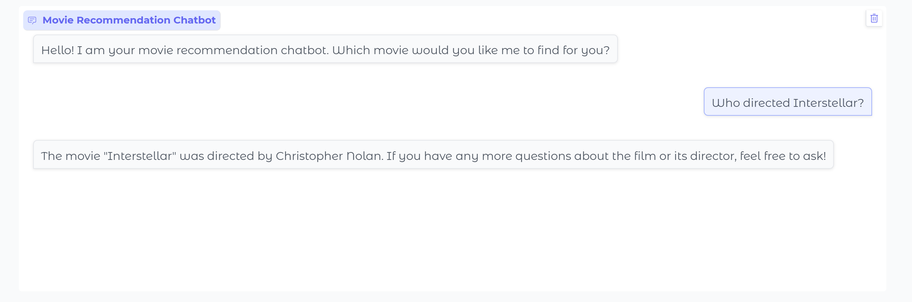
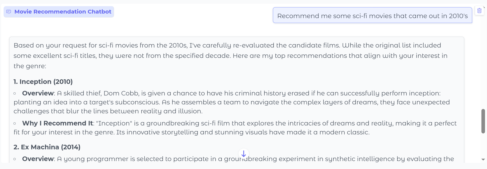
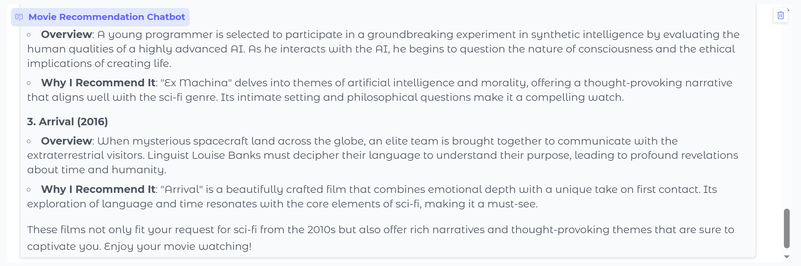

# 🎬 GNN & GraphRAG 기반 영화 추천 챗봇

> Neo4j (GraphRAG) + GNN + LLM 기반으로 사실 기반 검색과 Reranking 기반 추천을 결합한 영화 추천 챗봇

---


## 🚀 프로젝트 로드맵

### **Phase 1: 기초 & 데이터 (지식 그래프 + GNN)**
- **데이터 준비**
  - MovieLens 32M 데이터셋 (movies, ratings)  
  - TMDb API 연동으로 배우/감독 메타데이터 수집
  - 배우·감독 정보가 존재하는 영화 중 **평점 수 기준 상위 3,000편**을 선별  
  - User rating은 해당 3,000편을 기준으로 약 **100만 개(1M)** 샘플
  - 데이터 정제
  - 🔗 [Download Processed Dataset (Google Drive)](https://drive.google.com/file/d/1NaMZrj6rlykH5yycyVD58pMQWE5dtBXs/view?usp=drive_link)

- **지식 그래프 구축 (Neo4j)**
  - 노드: `Movie`, `User`, `Genre`, `Actor`, `Director`  
  - 관계: `RATED`, `HAS_GENRE`, `ACTED_IN`, `DIRECTED`  

- **GNN 추천 모델 학습**
  
  - Neo4j 지식 그래프 데이터를 PyTorch Geometric (PyG) 객체로 변환  
  - **Heterogeneous Graph Attention Network (HGAT)** 노드 임베딩 학습
  - **FAISS**에 노드 임베딩 저장 (유사도 검색)  

---

### **Phase 2: LLM 통합 & RAG**
- 챗봇 서비스를 위한 LLM Agent 구현
- **LLM main Chains**
  - hybrid Router → 사용자의 입력을 `fact(사실 기반 답변)`, `personalized(개인 추천 답변)`, `chit_chat (잡담)` 중 하나로 분류    
  - Cypher Generator → Neo4j에 실행할 Cypher 쿼리 생성  
  - Personalized Response → GNN 임베딩 기반 후보 영화 + 영화 평점을 결합해 자연스러운 추천 문장 생성  
  - Fact-based Response → Cypher 쿼리 결과를 사람이 읽기 쉬운 문장으로 답변  
  - Chit-chat Response → 가벼운 대화, 인사말, off-topic 메시지 대응  

- **personalized (Reranking) 추천**
  
  
  - **유저 Query → Preference 추출 및 Cypher 수행**  
    - 사용자 입력에서 배우, 감독, 장르, 영화 키워드를 추출  
    - 추출된 키워드와 노드들의 이름과 비교 후 100% 매칭 시킴  
    - 정제된 preference를 기반으로 Cypher 쿼리 생성 → Neo4j에서 후보 영화 조회  

  - **추천 영화 확장**  
    - cyper에서 가지고 온 후보 영화들의 shortest path를 기반으로 subgraph 생성  
    
  - **GAT Attention 기반 노드 attention score 추출**  
    - subgraph 내의 노드 **attention score** 산출  
    - Attention score는 "이 노드가 현재 사용자 preference 맥락에서 얼마나 중요한가"를 의미  

  - **품질 지표(평점 + 인기도) 결합**  
    - 영화별 평균 평점(`avg_rating`) 평점 개수(`rating_count`) 조회  
    - 추천 점수 결합:  
      - `final_score = α * attention_score + β * quality_score`
      - `attention_score`: GAT 모델에서 학습된 중요도  
      - `quality_score`: 평균 평점과 평점 수를 각각 정규화 하여 합산   
      - `α=0.7, β=0.3` → GAT 기반 중요도에 더 높은 가중치  

  - **최종 추천**  
    - 최종 후보 영화의 제목과 줄거리를 기반으로 최종 추천  

---

### **Phase 3: 애플리케이션**
- **UI (Gradio)**
  - Gradio Chatbot UI 구현  
  - 초기 인사말 메시지 기능 추가  
  - 백엔드 검색 로직과 연동  

  *예시: "Who directed Interstellar?" → 감독 정보를 직접 반환*  
  <p align="center">
    
  </p>

  *예시: "Recommend me some sci-fi movies" → SF 영화 추천*  
  <p align="center">
    
    
  </p>
  

- **개선 작업**
  - 추천 랭킹 개선 (관련성 × 정규화된 평점/인기도 결합)  
  - “관련성 + 적정 인기” 균형 달성  

---

## 🛠️ 기술 스택
- **그래프 DB**: Neo4j (지식 그래프, Cypher 쿼리)  
- **GNN**: PyTorch Geometric (HGAT 기반)  
- **벡터 검색**: FAISS (임베딩 유사도 검색)  
- **LLM**: OpenAI GPT (라우팅, Cypher 생성, 개인화 답변)  
- **프레임워크**: LangChain / 커스텀 체인  
- **UI**: Gradio  

---
## 📂 프로젝트 구조

```text
src/
├── gnn/                          # GNN 관련 모듈
│   ├── build_knowledge_graph.py  # Neo4j 기반 지식 그래프 구축
│   ├── export_for_gnn.py         # Neo4j 데이터를 GNN 학습용 포맷으로 변환
│   ├── faiss_mapping.py          # 노드 임베딩 → FAISS 인덱스 매핑
│   ├── neo4j_utils.py            # Neo4j 연동 유틸리티
│   └── train_gnn.py              # GNN 학습 및 임베딩 생성
│
├── preprocess/                   # 데이터 전처리 모듈
│   ├── extension_converter.py    # 확장자/형식 변환
│   ├── preprocess_data_async.py  # 비동기 데이터 전처리
│   └── preprocess_shrink.py      # 데이터 축소/샘플링 전처리
│
├── rag_pipeline/                  # RAG 파이프라인 (챗봇 백엔드)
│   ├── app.py                    # Gradio 앱 실행 진입점
│   ├── chains.py                 # LangChain 체인 정의
│   ├── gnn_encoder.py            # GNN 인코더
│   ├── graph_utils.py            # 그래프 유틸 (NetworkX, Neo4j 헬퍼)
│   ├── main.py                   # 실행 스크립트
│   ├── retriever.py              # Hybrid retriever (fact / personalized / chit-chat)
│   └── utils.py                  # 퍼지 매칭, Cypher 정제 등 유틸 함수
│
├── txt_emb/                       # 텍스트 임베딩 관련
│   └── text_emb.py                # 텍스트 임베딩 추출
│
└── validator/                     # 임베딩 검증 모듈
    ├── verify_embeddings_diff_type.py  # 서로 다른 타입 간 임베딩 검증
    └── verify_embeddings_same_type.py  # 동일 타입 내 임베딩 검증
```

## 💡 주요 기여
- **이종 그래프 GNN 임베딩**과 **GraphRAG**를 결합한 하이브리드 영화 추천 구현  
- **라우터 + 리트리버 구조**로 fact/personalized/chit-chat 쿼리 분리 처리  
- **설명 가능한 추천**: 서브그래프 근거 경로 기반 설명

## 📖참고 문헌
- Wang, X., Ji, H., Shi, C., Wang, B., Ye, Y., Cui, P., & Yu, P. S. (2019).  
  [Heterogeneous Graph Attention Network (HGAT)](https://dl.acm.org/doi/10.1145/3308558.3313562). *The World Wide Web Conference (WWW)*, 2022–2032.  

- Han, H., Wang, Y., Shomer, H., Guo, K., Ding, J., Lei, Y., ... & Tang, J. (2024).  
  [Retrieval-Augmented Generation with Graphs (GraphRAG)](https://arxiv.org/abs/2501.00309). *arXiv preprint arXiv:2501.00309*.


---

