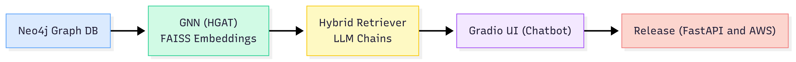
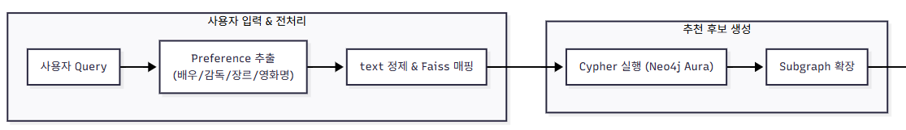
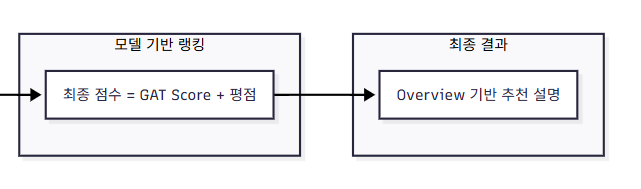

# 🎬 LLM Agent 영화 추천 챗봇


---


## 🚀 프로젝트 로드맵

### **Phase 1: 기초 & 데이터 (지식 그래프 + GNN)**
- **데이터 준비**
  - MovieLens 32M 데이터셋 (movies, ratings)  
  - TMDb API 연동으로 배우/감독 메타데이터 수집
  - 1980년 이후부터 2024년 까지의 영화 대상
  - 배우·감독 정보가 존재하는 영화 중 **평점 수 기준 상위 3,000편**을 선별
  - User rating은 약 **30만 개(300K)** 샘플
  - 데이터 정제
  - 🔗 [Download Processed Dataset (Google Drive)](https://drive.google.com/file/d/1PYOmmc4wWMleNUx6AeVUnLVl_CU4QgUw/view?usp=sharing)

- **지식 그래프 구축 (Neo4j Aura)**
  - 클라우드 기반인 Neo4j Aura를 사용하여 지식 그래프 구축
  - 노드: `Movie`, `User`, `Genre`, `Actor`, `Director`  
  - 관계: `RATED`, `HAS_GENRE`, `ACTED_IN`, `DIRECTED`  

- **GNN 모델 임베딩 학습 및 FAISS 벡터 db 구축**
  - Neo4j Aura의 지식 그래프를 PyTorch Geometric (PyG) 객체로 변환  
  - HeteroConv, GATConv기반으로 이종 노드 임베딩 학습
  - FAISS에 노드 임베딩 저장 (유사도 검색)  

---

### **Phase 2: LLM 통합 & RAG**
- 챗봇 서비스를 위한 LLM Agent (gpt-4o-mini) 도입
- **LLM main Chains**
  - Hybrid Router → 사용자의 입력을 `fact(사실 기반 답변)`, `recommendation(추천 답변)`, `chit_chat (잡담)` 중 하나로 분류    
  - Cypher Generator → Neo4j에 실행할 Cypher 쿼리 생성  
  - **recommendation Response** → GNN 임베딩 기반 후보 영화 + 영화 평점을 결합해 자연스러운 추천 문장 생성  
  - Fact-based Response → Cypher 쿼리 결과를 사람이 읽기 쉬운 문장으로 답변  
  - Chit-chat Response → 가벼운 대화, 인사말, off-topic 메시지 대응  

- **recommendation(추천 답변) 로직**
  
  
  - **Cypher 수행**  
    - 사용자 입력에서 배우, 감독, 장르, 영화 키워드를 추출  
    - 정제된 키워드를 기반으로 Cypher 쿼리 생성 → Neo4j에서 후보 영화 추출  

  - **추천 영화 확장**  
    - Neo4j에서 추출한 후보 영화들 간의 shortest path를 기반으로 Recommendation subgraph 생성  
    
  - **GAT Attention 기반 추천 점수 생성**  
    - Subgraph 내 모든 노드에 대해 GAT attention score를 산출 
    - Attention score와 영화 평점 기반 점수를 결합해 최종 추천 점수를 계산:  
      - `final_score = α * attention_score + β * quality_score`  
      - `attention_score`: GAT 모델에서 학습된 중요도  
      - `quality_score`: 평균 평점과 평점 수를 정규화 후 합산  

  - **최종 추천**  
    - LLM Chain에 추천 영화의 overview를 기반으로 답변 생성   
---

### **Phase 3: 애플리케이션**
- **UI (Gradio)**
  - Gradio 기반 챗봇 UI 구현

- **배포**
  - AWS EC2(t3.small) 환경에 웹 서버 구축
  - 백엔드 검색 로직(Faiss, Neo4j Aura) 연동
  - Docker 컨테이너로 서비스 패키징 및 배포
  - FastAPI 기반 웹 추천 시스템 서비스화
  -  **[👉 demo 체험하기 (FastAPI 웹 앱)](http://34.64.234.50:80/chat/)**  
---

## 🛠️ 기술 스택
- **그래프 DB**: Neo4j (지식 그래프, Cypher 쿼리)  
- **GNN**: PyTorch Geometric (HGAT 기반)  
- **벡터 검색**: FAISS (임베딩 유사도 검색)  
- **LLM**: OpenAI GPT (라우팅, Cypher 생성, 개인화 답변)  
- **프레임워크**: LangChain
- **UI**: Gradio
- **배포**: AWS (클라우드 서버),  FastAPI, Docker

---
## 📂 프로젝트 구조

```text
src/
├── gnn/                                # GNN 관련 모듈
│   ├── build_knowledge_graph_aura.py   # Neo4j 기반 지식 그래프 구축
│   ├── export_for_gnn.py               # Neo4j 데이터를 GNN 학습용 포맷으로 변환
│   ├── neo4j_utils.py                  # Neo4j 연동 유틸리티
│   └── train_gnn.py                    # GNN 학습 및 임베딩 생성
│
├── preprocess/                         # 데이터 전처리 모듈
│   ├── preprocess_data_async.py        # 비동기 데이터 전처리
│   └── preprocess_shrink.py            # 데이터 축소/샘플링 전처리
│
├── rag_pipeline/                       # RAG 파이프라인 (챗봇 백엔드)
│   ├── app.py                          # Gradio 앱 실행 진입점
│   ├── chains.py                       # LangChain 체인 정의
│   ├── retriever.py                    # Hybrid retriever (fact / personalized / chit-chat)
│   ├── gnn_encoder.py                  # GNN 인코더
│   ├── graph_utils.py                  # 그래프 유틸 (NetworkX, Neo4j 헬퍼)
│   └── utils.py                        # Cypher 정제 등 유틸 함수
│
└── txt_emb/                            # 텍스트 임베딩 관련
    └── text_emb.py                     # 노드 이름 임베딩 추출
    └── overview_emb.py                 # 영화 노드 overview 임베딩 추출
```

## 💡 주요 기여
- **이종 그래프 GNN 임베딩**과 **GraphRAG**를 결합한 하이브리드 영화 추천 구현  
- **router + retreiver 구조**로 fact/recommendation/chit-chat 쿼리 분리 처리  

## 📖참고 문헌
- Han, H., Wang, Y., Shomer, H., Guo, K., Ding, J., Lei, Y., ... & Tang, J. (2024).  
  [Retrieval-Augmented Generation with Graphs (GraphRAG)](https://arxiv.org/abs/2501.00309). *arXiv preprint arXiv:2501.00309*.

- Hu, Z., Dong, Y., Wang, K., & Sun, Y. (2022).  
  [Heterogeneous Graph Transformer](https://dl.acm.org/doi/abs/10.1145/3366423.3380027). *In Proceedings of the web conference 2020 (pp. 2704-2710).

- Wang, X., Ji, H., Shi, C., Wang, B., Ye, Y., Cui, P., & Yu, P. S. (2019).  
  [Heterogeneous Graph Attention Network](https://dl.acm.org/doi/10.1145/3308558.3313562). *The World Wide Web Conference (WWW)*, 2022–2032.  


---

